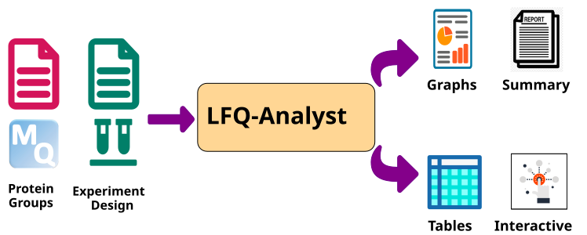

# LFQ-Analyst

[![bio.tools](https://img.shields.io/badge/bio.tools-LFQ--Analyst-blue.svg?labelColor=gray&logo=data:image/svg%2bxml;base64,PHN2ZyBpZD0idXVpZC02ZTIxYTIzOC04NWFmLTRlNDctYjI1OC05ZTEyZDg2MzJmYmUiIHhtbG5zPSJodHRwOi8vd3d3LnczLm9yZy8yMDAwL3N2ZyIgdmlld0JveD0iMCAwIDQzMi44NCA0MzIuODQiPjxwYXRoIGQ9Ik01NS4zLDQyNy4yN2wtNDkuNzMtNDkuNzNjLTcuNDMtNy40My03LjQzLTE5LjQ3LDAtMjYuODlsMTMxLjYzLTEzMS42M2M3LjQzLTcuNDMsMTkuNDctNy40MywyNi44OSwwbDQ5LjczLDQ5LjczYzcuNDMsNy40Myw3LjQzLDE5LjQ3LDAsMjYuODlsLTEzMS42MywxMzEuNjNjLTcuNDMsNy40Mi0xOS40Niw3LjQyLTI2Ljg5LDBaIiBmaWxsPSIjZmZmIi8+PHBhdGggZD0iTTIyNy43MSwyNTUuNzFsLTcuMTgsNy4zNy02LjM0LDYuNC01MS4xMy01MC4xOSw2LjM0LTYuNCw3LjE4LTcuMzdjNi42NC02Ljc2LDE3LjQ1LTYuODYsMjQuMjEtLjIybDI2LjY5LDI2LjJjNi43Nyw2LjY0LDYuODcsMTcuNDUuMjMsMjQuMjFoMFoiIGZpbGw9IiNmZmYiLz48cGF0aCBkPSJNNDMwLjQsMTguNTNsLTE2LjExLTE2LjEiIGZpbGw9IiNmZmYiLz48cGF0aCBkPSJNMzQ4LjQ2LDYzLjM3bC0xMTkuNzQsMTE5LjczLTI0Ljk0LDI0Ljk0LDIxLjAxLDIxLjAxLDI0Ljk0LTI0Ljk0LDExOS43NC0xMTkuNzMiIGZpbGw9IiNmZmYiLz48cGF0aCBkPSJNMzY5LjQ0LDg0LjM4bDI3LjE2LDEuOSwzNi4yNC02NS4zTDQxMS44NSwwbC02NS4zLDM2LjIzLDEuOSwyNy4xNyIgZmlsbD0iI2ZmZiIvPjxwYXRoIGQ9Ik0xMTIuNjEsMTU1LjZjLTI5LjE0LDExLjgzLTYzLjgsNS45NC04Ny40NC0xNy43QzIuOTYsMTE1LjY5LTMuNTgsODMuNzcsNS41NCw1NS44MyIgZmlsbD0iI2ZmZiIvPjxwYXRoIGQ9Ik01Ny4xMiw0LjI2YzI3LjkxLTkuMTUsNTkuODctMi41OCw4Mi4wNywxOS42MywyMy42MSwyMy42MSwyOS41Myw1OC4yNSwxNy43LDg3LjM5IiBmaWxsPSIjZmZmIi8+PHBhdGggZD0iTTI3Ny4yMywzMjAuMjJjLTExLjgzLDI5LjE0LTUuOTQsNjMuOCwxNy43LDg3LjQ0LDIyLjIxLDIyLjIxLDU0LjEzLDI4Ljc1LDgyLjA3LDE5LjYzIiBmaWxsPSIjZmZmIi8+PHBhdGggZD0iTTMyMS41NiwyNzUuOTRjMjkuMTQtMTEuODMsNjMuNzgtNS45Miw4Ny4zOSwxNy43LDIyLjIxLDIyLjIxLDI4Ljc4LDU0LjE2LDE5LjYzLDgyLjA3IiBmaWxsPSIjZmZmIi8+PHBhdGggZD0iTTE2My45MSwyMDcuNTRMNDIuNyw5MS4yNmw1MC43MS00OC4xMiwxMzAuMjMsMTM1LjU3LTkuMjIsOS4xOC0xMy4wOSwxMi4yOC01Ljk4LTQuMTloMGMtLjI4LS4xOC00LjMtMi4yMy00LjYtMi4zNi0uMzctLjE2LTEuOTUtMS4xNi01LjctLjg0LTMuMTEuMjctNS43NCwxLjYyLTguNTcsMy45OGwtMTIuNTgsMTAuNzhoLjAxWiIgZmlsbD0iI2ZmZiIvPjxwYXRoIGQ9Ik0yMjQuMTgsMjY4LjI0bDExNS4zMywxMjAuNDQsNDguMzMtNTAuODktMTM0LjUyLTEyOS4zNC05LjIyLDkuMjYtMTIuMzQsMTMuMTMsNC4xNSw1Ljk1aDBjLjE3LjI4LDIuMiw0LjI4LDIuMzMsNC41OC4xNi4zNywxLjE1LDEuOTQuOCw1LjY4LS4yOCwzLjEtMS42NSw1Ljc0LTQuMDMsOC41OGwtMTAuODQsMTIuNjJoLjAxWiIgZmlsbD0iI2ZmZiIvPjwvc3ZnPg==)](https://bio.tools/LFQ-Analyst)


[![Bridge](https://img.shields.io/badge/bridge-bio.tools%20%E2%86%92%20github-blue.svg?labelColor=orange&logo=data:image/svg%2bxml;base64,PHN2ZyBpZD0idXVpZC0zYTVmNzA5MS0xMzM2LTQxNGUtYjBmNS1jMDdkMmQwYWM2MDEiIHhtbG5zPSJodHRwOi8vd3d3LnczLm9yZy8yMDAwL3N2ZyIgdmlld0JveD0iMCAwIDEwLjAxIDYuOCI+PHBhdGggZD0iTTUuNjYsNS42NmwtLjc0Ljc0Yy0uMjYuMjYtLjU5LjQtLjk1LjRzLS43LS4xNC0uOTYtLjRMLjUyLDMuOTFjLS4yMy0uMjMtLjM3LS41My0uMzktLjg1TDAsMS40NWMtLjAzLS4zNy4xLS43NC4zNi0xLjAxQy42NC4xNCwxLjA0LS4wMiwxLjQ1LjAxbDEuNjEuMTJjLjMyLjAzLjYyLjE3Ljg0LjM5bC42Mi42MWMuMTYuMTcuMTYuNDMsMCwuNTktLjE3LjE2LS40My4xNi0uNTksMGwtLjYxLS42MWMtLjA5LS4wOS0uMi0uMTQtLjMzLS4xNWwtMS42LS4xM2MtLjE2LS4wMS0uMzIuMDUtLjQyLjE3LS4xLjEtLjE1LjI1LS4xNC4zOWwuMTMsMS42MWMuMDEuMTIuMDYuMjQuMTUuMzJsMi40OSwyLjVjLjEuMDkuMjMuMTUuMzcuMTUuMTMsMCwuMjYtLjA2LjM2LS4xNWwuNzQtLjc0Yy4wMi4xNC4wOS4yOC4yLjM4LjEuMTEuMjQuMTguMzkuMloiIGZpbGw9IiNmZmYiLz48cGF0aCBkPSJNMTAsMS40NWwtLjEzLDEuNjFjLS4wMi4zMi0uMTYuNjItLjM5Ljg1bC0yLjQ5LDIuNDljLS4yNi4yNi0uNi40LS45Ni40LS4xMiwwLS4yNS0uMDItLjM3LS4wNS0uMjItLjA3LS4zNC0uMy0uMjgtLjUyLjA2LS4yMi4yOS0uMzQuNTEtLjI4LjA1LjAxLjEuMDIuMTQuMDIuMTQsMCwuMjctLjA2LjM3LS4xNWwyLjQ5LTIuNWMuMDktLjA4LjE1LS4yLjE1LS4zMmwuMTMtMS42MWMuMDEtLjE0LS4wNC0uMjktLjE0LS4zOS0uMS0uMTItLjI2LS4xOC0uNDItLjE3bC0xLjYuMTNjLS4xMy4wMS0uMjQuMDYtLjMzLjE1bC0xLjc3LDEuNzdjLS4wMy0uMTQtLjEtLjI3LS4yMS0uMzgtLjEtLjExLS4yNC0uMTgtLjM4LS4ybDEuNzgtMS43OGMuMjItLjIyLjUyLS4zNi44NC0uMzlsMS42MS0uMTJzLjA3LS4wMS4xLS4wMWMuMzgsMCwuNzQuMTYuOTkuNDQuMjYuMjcuMzkuNjQuMzYsMS4wMVoiIGZpbGw9IiNmZmYiLz48Y2lyY2xlIGN4PSI4LjA1IiBjeT0iMS45NiIgcj0iLjcxIiBmaWxsPSIjZmZmIi8+PGNpcmNsZSBjeD0iMS45NiIgY3k9IjEuOTYiIHI9Ii43MSIgZmlsbD0iI2ZmZiIvPjxwYXRoIGQ9Ik00LjUyLDUuMjVjLS4xMi4xMi0uMzEuMTUtLjQ2LjA5LS4wNS0uMDItLjA5LS4wNS0uMTMtLjA5bC0uMzMtLjMzYy0uMjUtLjI1LS4zOS0uNTktLjM5LS45NXMuMTQtLjcuMzktLjk1bC4zMS0uMzFjLjE2LS4xNi40Mi0uMTYuNTgsMCwuMTUuMTUuMTcuMzkuMDMuNTZsLS4zMy4zM2MtLjEuMS0uMTYuMjMtLjE2LjM3cy4wNi4yNy4xNi4zN2wuMzMuMzNjLjE2LjE3LjE2LjQyLDAsLjU4WiIgZmlsbD0iI2ZmZiIvPjxwYXRoIGQ9Ik02Ljc5LDMuOTdjMCwuMzYtLjE0LjctLjM5Ljk1bC0uMzMuMzNjLS4xNy4xNi0uNDMuMTYtLjU5LDAtLjE1LS4xNS0uMTYtLjM5LS4wMy0uNTVsLjM2LS4zNmMuMS0uMS4xNi0uMjMuMTYtLjM3cy0uMDYtLjI3LS4xNi0uMzdsLS4zLS4zYy0uMTYtLjE2LS4xNi0uNDIsMC0uNTkuMDgtLjA4LjE5LS4xMi4yOS0uMTIuMDcsMCwuMTQuMDIuMi4wNXMuMTEuMDguMTYuMTNjLjA4LjA4LjE1LjE1LjI0LjI0LjI1LjI1LjM5LjU5LjM5Ljk1WiIgZmlsbD0iI2ZmZiIvPjwvc3ZnPg==)](https://bio-tools.github.io/biohackathon2025/)

[](https://www.repostatus.org/#active)


A tool for analysing label-free quantitative proteomics dataset https://bioinformatics.erc.monash.edu/apps/LFQ-Analyst/




## Motivation

- Automate downstream statistical analysis of Label free quantitative proteomics data (generated by MaxQuant)


### Input

- MaxQuant **proteinGroups.txt** file
- An experiment design table (tab separated file) containing three columns ("label", "condition", "replicate")

#### Data pre-filtering criteria

- Remove potential contaminants
- Remove reverse sequences
- Remove proteins identified only by sites
- Remove proteins identified/quantified by a single Razor or unique peptide
- Remove observation with high proportion of missing values (intensity values must be present
at least 2 out of three replicates)

#### Advanced parameters to choose

- Differencial expression cutoff
  - Adjusted p-value cutoff (FDR cutoff on quantitation)
  - Log2 fold change cutoff
- Option to choose paired test for matched pair data
- Types of imputation
  - A number of missing value imputation options including knn, Minpob etc.
- Type of FDR correction
  -   Benjamin Hochberg (BH) method
  -   t-statistics correction: Implemented in
    [fdrtools](http://strimmerlab.org/software/fdrtool/)
- Option to include proteins identified/quantified with a single unique peptide.
- Select how many clusters of differentially expressed proteins needed for the heatmap (default is 6)


### Outputs

#### Result table

-   **LFQ Results Table:** Includes names (Gene names), Protein Ids, Log
    fold changes/ ratios (each pairwise comparisons), Adjusted
    *p-values* (applying FDR corrections), *p-values*, Boolean values
    for significance, average protein intensity (log transformed) in
    each sample.

#### Result Plots
  1. Interactive volcano plot for each pairwise comparison.
  2. Heatmap of differencially expressed proteins
  3. Protein intensity plots for a single or group of selected proteins from table. 

#### QC Plots
  1. PCA plot (Could move to QC section)
  2. Sample Correlation (pearson correlation)
  3. Sample Coefficient of variations (CVs)
  4. Number of proteins per sample
  5. Sample coverage (overlap of identified proteins across every sample)
  6. Missing value heatmap
  7. Imputation effect on sample distribution

### Download options

**Download tables** (csv format)

1.  Results: Same as *LFQ Results Table*
2.  Unimputed data matrix: Original protein intensities before
    imputation in each sample.
3.  Imputed data matrix: Protein intensities after performing selected
    imputation method
4.  Full results: Combined table of all above data outputs i.e. with and
    without imputation information, along with fold change and p-values.

**Download Report** 
- A summary report for each analysis that
    includes method, summary statistics and plots.


### Local installation

The current version of LFQ-Analyst is hosted on `R - 4.2.1`. The detailed dependency information can be found in the `dependencies.txt` file.

Once installed all the dependencies following steps to run the server locally.

- Using git and Rstudio
```
## Clone the repository
git clone https://github.com/MonashBioinformaticsPlatform/LFQ-Analyst.git

## Move to the folder
cd LFQ-Analyst

## Inside R console or R studio
> library("shiny")

> runApp()

```

- Using Docker

Install & start Docker demon on your PC

```
## Option one：
## Pull LFQ-Analyst image from Docker Hub (From terminal)
> docker pull haileyzhang/lfq-analyst:tagname

## Option two：
## Clone the repository
git clone https://github.com/MonashBioinformaticsPlatform/LFQ-Analyst.git

## Move to the folder
cd LFQ-Analyst

## Build LFQ-Analyst (Any name after -t)
> docker build -f Dockerfile -t LFQ-Analyst .

## Run LFQ-Analyst (From terminal)

> docker run -p 3838:3838 LFQ-Analyst

## Open local interface

https://localhost:3838/LFQ-Analyst


```
